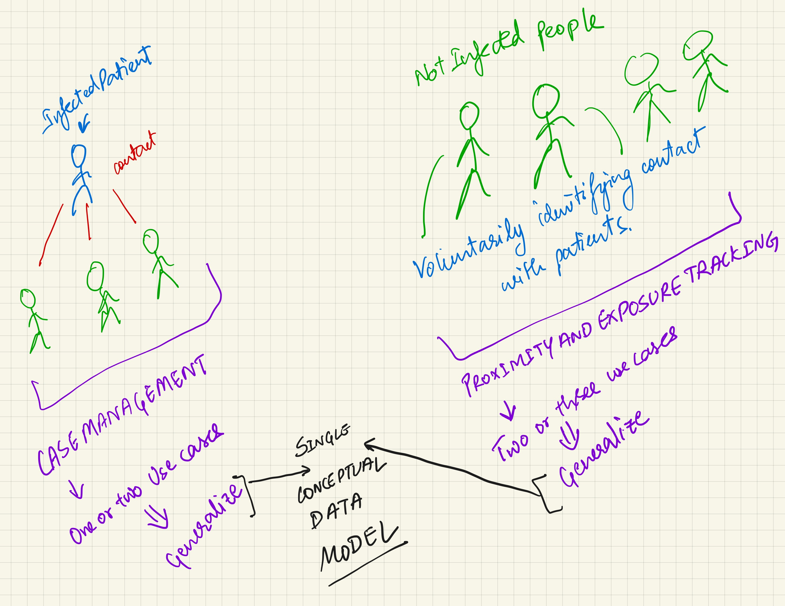
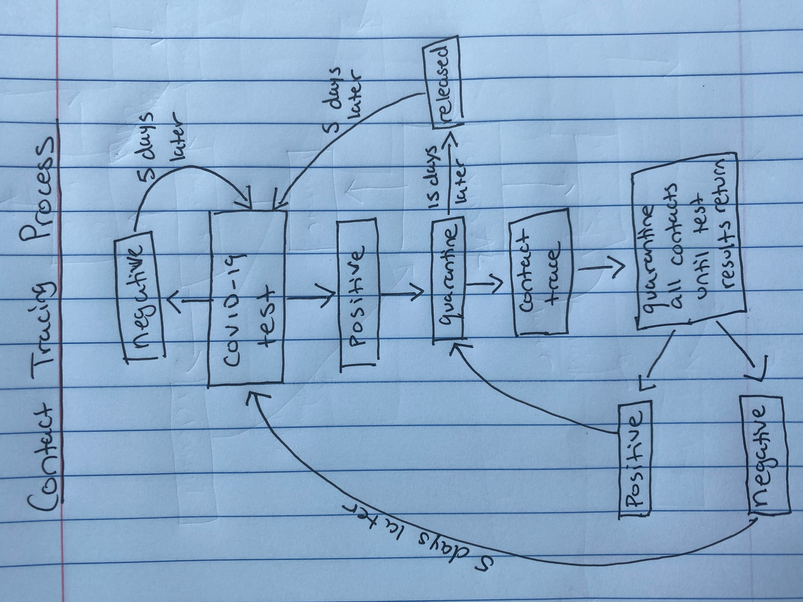

### Meeting #1 - October 8th, 2020

* Use case ideas: 
  + boarding school interaction with public high school
  + farmers' market interaction w/ open air dining
  + small college located in small town
  


### Meeting #2 - October 9th, 2020

Use case: boarding school

* Places:
  + dorms of students (residential)
    - common rooms
    - dorm rooms
    - communal bathrooms
  + buildings of classrooms (academic)
    - hallways
    - classrooms
    - bathrooms
    - teachers lounge
    - auditorium
    - music rooms
  + athletic facilities (extracurricular)
    - locker rooms
    - stadium seating
    - gymnasium
    - training room
    - trainer's room
  + dining facilities (residential)
    - cafeteria
    - kitchen
    - bathrooms 
  + administrative building (administrative)
    - offices
    - bathrooms
    - visitor's center
    - health center
    
* People: 
  + students (100% boarding)
  + faculty 
    - History
    - English
    - Mathematics
    - Science 
    - Foreign Language
    - Music/Theater
    - Visual Arts
    - Social Science
  + staff
    - administration
    - dining services
    - facilities management
    - health services
    - public safety
    - athletics
  + visitor
    - family
    - prospective students
    - other schools
    - alumni 
    
* Misc:
  + roster
  + medical data
    
### Meeting #3 - October 10th, 2020
  
* Contact tracing process:
  + every person on campus is tested every 5 days
  + when someone tests positive, immediately quarantined (quarantined for 15 days)
  + following quarantine, person is put back into population pool (can get reinfected)
  + interactions over past 5 days are tracked based on schedule and rosters
  + everyone who has interacted with patient 0 must quarantine until they receive negative test results, or if they test positive, start contact tracing through their schedules (recursive query)



    

This is an [R Markdown](http://rmarkdown.rstudio.com) Notebook. When you execute code within the notebook, the results appear beneath the code. 

Try executing this chunk by clicking the *Run* button within the chunk or by placing your cursor inside it and pressing *Cmd+Shift+Enter*. 

```{r}
plot(cars)
```

Add a new chunk by clicking the *Insert Chunk* button on the toolbar or by pressing *Cmd+Option+I*.

When you save the notebook, an HTML file containing the code and output will be saved alongside it (click the *Preview* button or press *Cmd+Shift+K* to preview the HTML file). 

The preview shows you a rendered HTML copy of the contents of the editor. Consequently, unlike *Knit*, *Preview* does not run any R code chunks. Instead, the output of the chunk when it was last run in the editor is displayed.

