### Use Case
#### Contact Tracing DBMS for grades 9-12 boarding school

* Description: This use case is being implemented because it presents an opportunity to build a system within the specific / unique constraints of a residential school. The expected outcome of this use case is for boarding school administrators to be able to accurately and efficiently track the spread of COVID-19 through the campus and take appropriate measures such as the imposition of quarantine to mitigate the spread of the virus. 

* Actors:
  + Database Architects: A. Daccache, H. Sidhu, R. Zipp for CS5200 F2020.
  + Secondary Actors: School administrators, student life professionals, and school nurse's offices.  
  &nbsp;
* Precondition: All students, faculty, and staff should be assigned a unique School ID and accounted for in the DMBS. The school nurse's office must have the capacity to administer COVID-19 tests once every five days and the school should have the capacity to quarantine as many COVID-19 positive individuals as needed.

* Post-condition: DBMS successfully guides policy decisions regarding COVID-19 responses at the school without failing.

* Flow:
  1. The structure of the school is outlined via data inserts to Building and SpaceRoom tables. 
  2. Faculty, staff, and student information inserted into DB. 
  3. Baseline medical records created for each entry.
  4. Events such as classes and athletic events are scheduled and inserted into Events table. Attendees are recorded in EventAttendees table.
  5. Entire school population is tested once every 5 days for COVID-19. Upon a positive diagnosis, the following protocols are activated:
    i) Positive tests initiate creation of CaseID table and TreatmentPlan attribute associated with  MedicalID. People.IsQuar attribute is updated to "True" and reverts to False after 15 days have passed.
    ii) DBMS runs contact tracing query. Attendees of events where positive patient was also present are also quarantined with IsQuar = true.
  
* Alternative Flows: None to consider in this model. Possible future builds include protocols for moving patients offsite to hospital.

* Exceptions:
  1. A quarantined person cannot attend events. 
  2. CaseID cannot be non-null without corresponding positive test result.
  3. People cannot attend events on the same day that begin at the same time.
  4. Group IDs (1 = student, 2 = faculty, 3 = staff) are final / immutable.
 
  
* Requirements: Assuming implementation in the United States, DBMS must be compliant with US privacy law, specifically the provisions of FERPA and HIPAA. 

### Conceptual Model

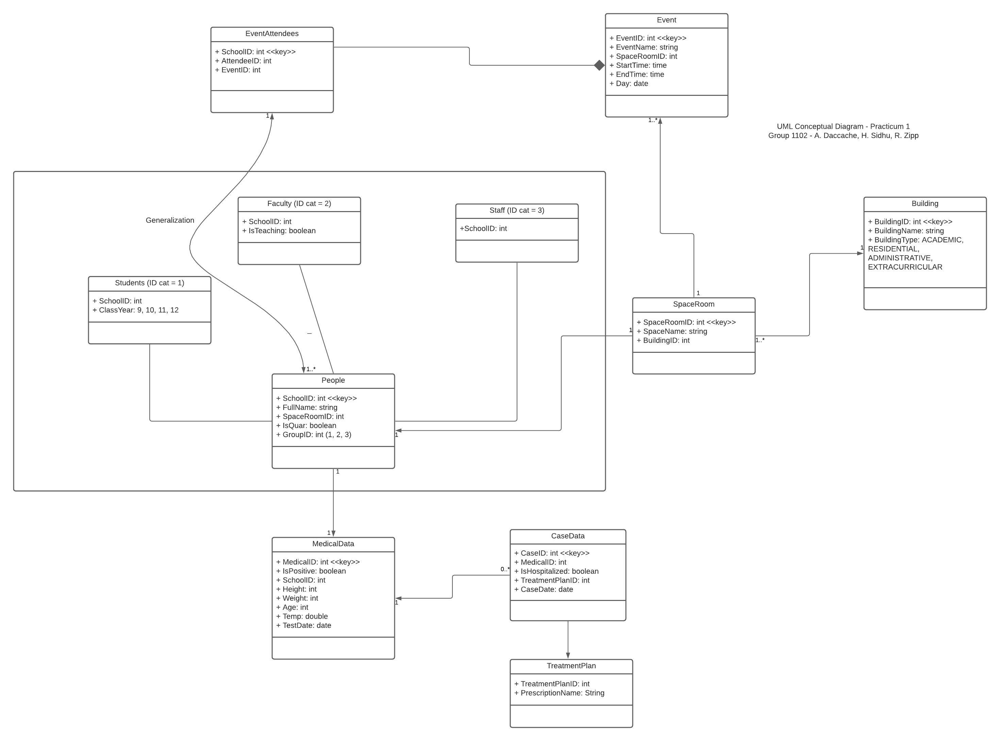

### Logical Data Model
hi

##### ERD

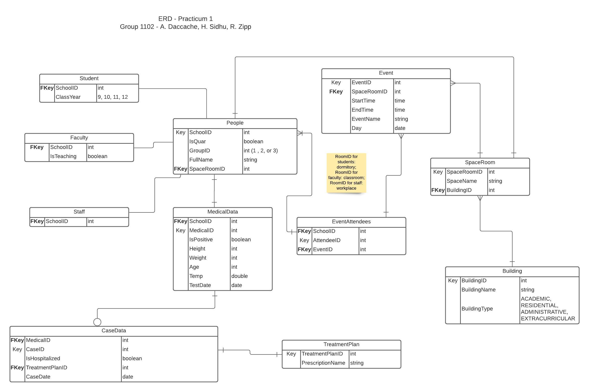

### SQL Data Definition Statements

##### Building Table
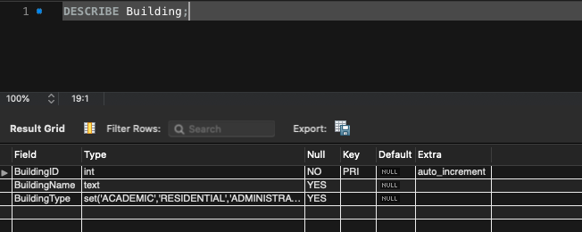  
``

##### SpaceRoom Table
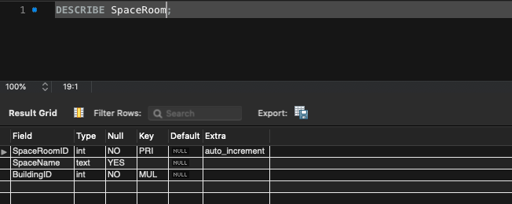  

##### People Table
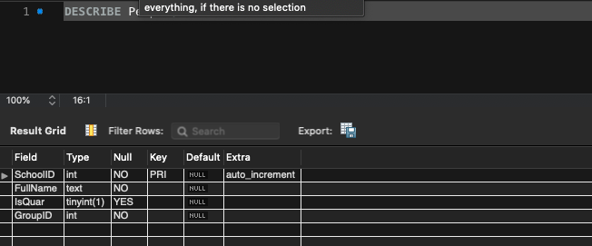  

##### Student Table
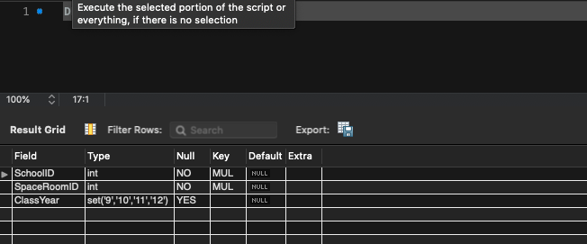  

##### Faculty Table
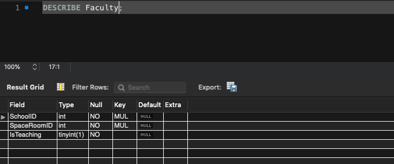  

##### Staff Table
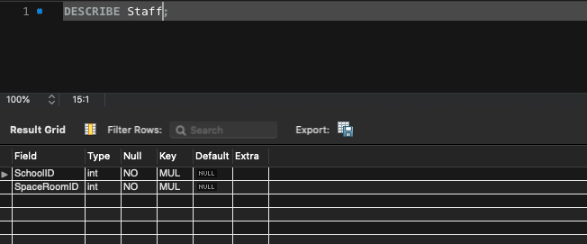  

##### Event Table
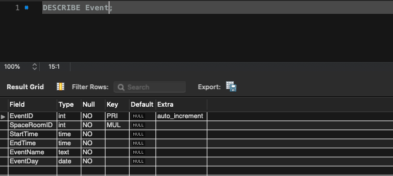  

##### EventAtendees Table
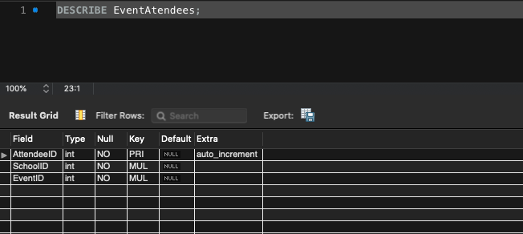  

##### MedicalData Table
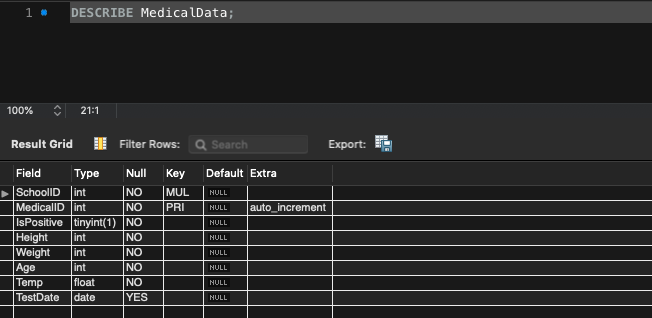  

##### TreatmentPlan Table
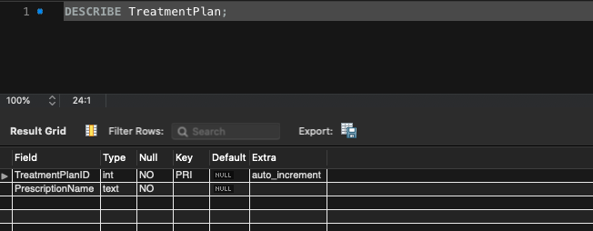  

##### CaseData Table
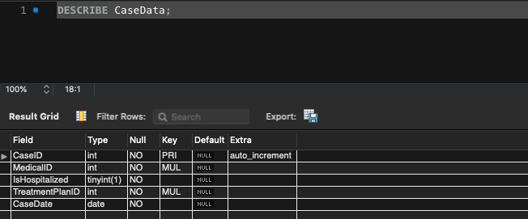  

#### BCNF
 - explanation for 1NF through BCNF

### Queries 
hi

##### Query A
hi

##### Query B
hi

##### Query C
hi

##### Query D
hi

##### Query E
hi

